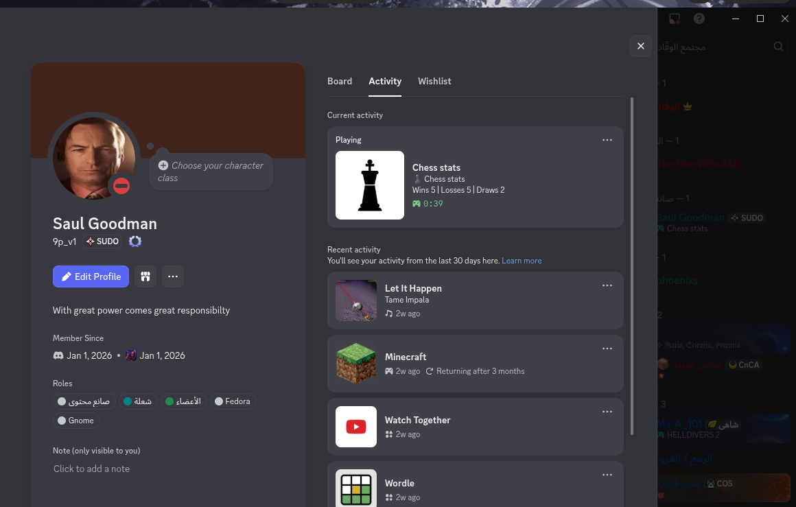
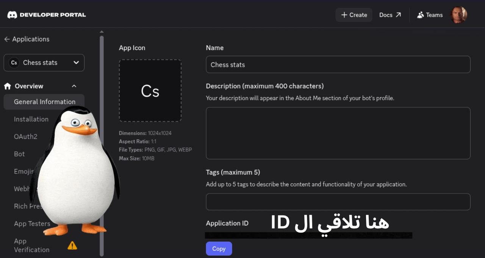

# ♟️ Chess Discord Rich Presence

Show your Chess.com stats directly on your Discord profile in real time!




```
🟢 YourName
   ♟️ | Chess stats
   Wins 5 | Losses 5 | Draws 2
```

---

## ✨ Features

- Displays your **Rating**, **Wins**, **Losses**, and **Draws** on Discord
- Shows your **League** on the image tooltip
- **Auto-updates** every 15 seconds
- Works with any Chess.com username
- Error handling for invalid usernames and Discord connection issues

---

## 📋 Requirements

- Python 3.8+
- Discord Desktop App (must be running)
- A Chess.com account
- A Discord Application ID

---

## 📦 Installation

**1. Clone the repository**
```bash
git clone https://github.com/yourusername/chess-discord-presence
cd Chess_Status
```

**2. Install dependencies**
```bash
pip install -r requirements.txt
```

---

## ⚙️ Setup

<p align="center">
  
</p>

### Discord Application ID
1. Go to [Discord Developer Portal](https://discord.com/developers/applications)
2. Click **New Application** and name it (e.g. `Chess Stats`)
3. Copy the **Application ID**

### Rich Presence Image (Optional)
1. In the Developer Portal go to **Rich Presence** → **Art Assets**
2. Upload an image and name it `chess`

---

## 🚀 Usage

```bash
python3 main.py
```

You will be asked for:
```
Enter your chess.com account username: YourUsername
Enter your Discord Application ID: 123456789012345678

```

---

## 🛠️ Built With

- [requests](https://docs.python-requests.org/) — Fetch data from Chess.com API
- [pypresence](https://pypresence.dev/) — Update Discord Rich Presence
- [Chess.com API](https://www.chess.com/news/view/published-data-api) — Public chess stats

---

## 📄 License

MIT License — feel free to use and modify!
